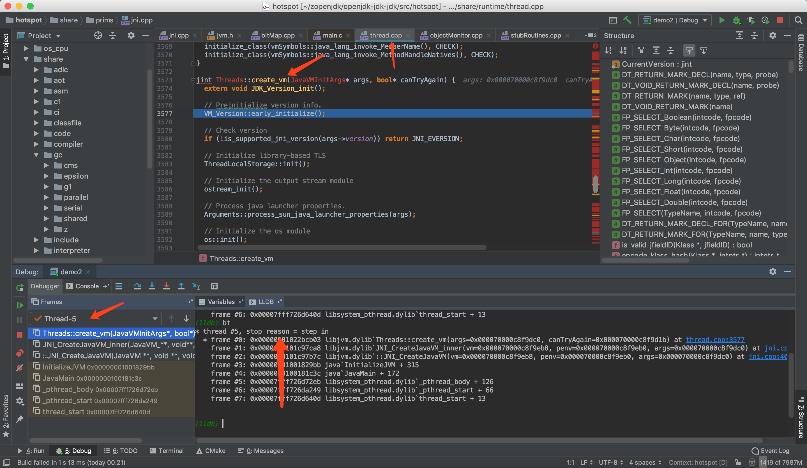

openjdk10 源码分析

入口函数  
path：~/openjdk-jdk-jdk/src/java.base/share/native/launcher/main.c

```
JNIEXPORT int
main(int argc, char **argv){

    ...

     return JLI_Launch(margc, margv,
                   jargc, (const char**) jargv,
                   0, NULL,
                   VERSION_STRING,
                   DOT_VERSION,
                   (const_progname != NULL) ? const_progname : *margv,
                   (const_launcher != NULL) ? const_launcher : *margv,
                   jargc > 0,
                   const_cpwildcard, const_javaw, 0);

}

```


跟踪HotSpot的初始化过程
1)        首先执行版本检查；

2)        检查并确认是否支持当前的JNI版本，并调用ostram_init()函数初始化输出流模块；

3)        调用Arguments模块的process_sun_java_launcher_propertites()函数配置Launcher的一些相关参数；

4)        调用init()函数初始化os模块，包括：随机数生成器(Random Number Generator)、当前进程id（CurrentProcess id）、高精度计时器（High-Resolution Timer）、内存页尺（Memory Page Size）,以及保护页（Guard Pages）等；

5)        初始化一些系统属性，比如：java.version、java.vendor 和 os.name等；

6)        参数解析和记录系统虚拟机的创建时间等；

7)        在解析args参数后调用os模块的init_2()函数对内存、栈、线程等与os模块密切相关的部分进行初始化；

8)        配置垃圾收集器的输出流模块；

9)        如果用到agent库（hprof、 jdi）的话，则初始化并启动；

10)    初始化全局线程队列；

11)    初始化TLS模块；

12)    调用vm_init_globals()函数初始化全局数据结构，包括：事件日志（Event Log）、os同步原语、性能统计数据内存（perfMemory），以及内存分配器（chunkPool）等；

13)    创建Java主线程；

14)    初始化启动类加载器（Bootstrap ClassLoader）、CodeCache、解释器、JIT编译器、JNI、系统词典（System Dictionadry）等；

15)    将之前创建的java主线程合并到线程队列中；

16)    创建VM Thread;

17)    初始化java API中的一些基础类

18)    启动Signal Dispatcher线程

19)    初始化JIT编译器，并启动HotSpot编译代理线程

20)    启动HotSpot中的一些辅助线程。




````
 result = Threads::create_vm((JavaVMInitArgs*) args, &can_try_again);

path: share/runtime/thread.cpp

jint Threads::create_vm(JavaVMInitArgs* args, bool* canTryAgain) {
  extern void JDK_Version_init();

  // Preinitialize version info.
  VM_Version::early_initialize();

  // Check version
  if (!is_supported_jni_version(args->version)) return JNI_EVERSION;

  // Initialize library-based TLS
  ThreadLocalStorage::init();

  // Initialize the output stream module
  ostream_init();

  // Process java launcher properties.
  Arguments::process_sun_java_launcher_properties(args);

  // Initialize the os module
  os::init();

  // Record VM creation timing statistics
  TraceVmCreationTime create_vm_timer;
  create_vm_timer.start();

  // Initialize system properties.
  Arguments::init_system_properties();

  // So that JDK version can be used as a discriminator when parsing arguments
  JDK_Version_init();

  // Update/Initialize System properties after JDK version number is known
  Arguments::init_version_specific_system_properties();

  // Make sure to initialize log configuration *before* parsing arguments
  LogConfiguration::initialize(create_vm_timer.begin_time());

  // Parse arguments
  // Note: this internally calls os::init_container_support()
  jint parse_result = Arguments::parse(args);
  if (parse_result != JNI_OK) return parse_result;

  os::init_before_ergo();

  jint ergo_result = Arguments::apply_ergo();
  if (ergo_result != JNI_OK) return ergo_result;

  // Final check of all ranges after ergonomics which may change values.
  if (!JVMFlagRangeList::check_ranges()) {
    return JNI_EINVAL;
  }

  // Final check of all 'AfterErgo' constraints after ergonomics which may change values.
  bool constraint_result = JVMFlagConstraintList::check_constraints(JVMFlagConstraint::AfterErgo);
  if (!constraint_result) {
    return JNI_EINVAL;
  }

  JVMFlagWriteableList::mark_startup();

  if (PauseAtStartup) {
    os::pause();
  }

  HOTSPOT_VM_INIT_BEGIN();

  // Timing (must come after argument parsing)
  TraceTime timer("Create VM", TRACETIME_LOG(Info, startuptime));

#ifdef CAN_SHOW_REGISTERS_ON_ASSERT
  // Initialize assert poison page mechanism.
  if (ShowRegistersOnAssert) {
    initialize_assert_poison();
  }
#endif // CAN_SHOW_REGISTERS_ON_ASSERT

  // Initialize the os module after parsing the args
  jint os_init_2_result = os::init_2();
  if (os_init_2_result != JNI_OK) return os_init_2_result;

  SafepointMechanism::initialize();

  jint adjust_after_os_result = Arguments::adjust_after_os();
  if (adjust_after_os_result != JNI_OK) return adjust_after_os_result;

  // Initialize output stream logging
  ostream_init_log();

  // Convert -Xrun to -agentlib: if there is no JVM_OnLoad
  // Must be before create_vm_init_agents()
  if (Arguments::init_libraries_at_startup()) {
    convert_vm_init_libraries_to_agents();
  }

  // Launch -agentlib/-agentpath and converted -Xrun agents
  if (Arguments::init_agents_at_startup()) {
    create_vm_init_agents();
  }

  // Initialize Threads state
  _thread_list = NULL;
  _number_of_threads = 0;
  _number_of_non_daemon_threads = 0;

  // Initialize global data structures and create system classes in heap
  vm_init_globals();

#if INCLUDE_JVMCI
  if (JVMCICounterSize > 0) {
    JavaThread::_jvmci_old_thread_counters = NEW_C_HEAP_ARRAY(jlong, JVMCICounterSize, mtInternal);
    memset(JavaThread::_jvmci_old_thread_counters, 0, sizeof(jlong) * JVMCICounterSize);
  } else {
    JavaThread::_jvmci_old_thread_counters = NULL;
  }
#endif // INCLUDE_JVMCI

  // Attach the main thread to this os thread
  JavaThread* main_thread = new JavaThread();
  main_thread->set_thread_state(_thread_in_vm);
  main_thread->initialize_thread_current();
  // must do this before set_active_handles
  main_thread->record_stack_base_and_size();
  main_thread->set_active_handles(JNIHandleBlock::allocate_block());

  if (!main_thread->set_as_starting_thread()) {
    vm_shutdown_during_initialization(
                                      "Failed necessary internal allocation. Out of swap space");
    main_thread->smr_delete();
    *canTryAgain = false; // don't let caller call JNI_CreateJavaVM again
    return JNI_ENOMEM;
  }

  // Enable guard page *after* os::create_main_thread(), otherwise it would
  // crash Linux VM, see notes in os_linux.cpp.
  main_thread->create_stack_guard_pages();

  // Initialize Java-Level synchronization subsystem
  ObjectMonitor::Initialize();

  // Initialize global modules
  jint status = init_globals();
  if (status != JNI_OK) {
    main_thread->smr_delete();
    *canTryAgain = false; // don't let caller call JNI_CreateJavaVM again
    return status;
  }

  JFR_ONLY(Jfr::on_vm_init();)

  // Should be done after the heap is fully created
  main_thread->cache_global_variables();

  HandleMark hm;

  { MutexLocker mu(Threads_lock);
    Threads::add(main_thread);
  }

  // Any JVMTI raw monitors entered in onload will transition into
  // real raw monitor. VM is setup enough here for raw monitor enter.
  JvmtiExport::transition_pending_onload_raw_monitors();

  // Create the VMThread
  { TraceTime timer("Start VMThread", TRACETIME_LOG(Info, startuptime));

  VMThread::create();
    Thread* vmthread = VMThread::vm_thread();

    if (!os::create_thread(vmthread, os::vm_thread)) {
      vm_exit_during_initialization("Cannot create VM thread. "
                                    "Out of system resources.");
    }

    // Wait for the VM thread to become ready, and VMThread::run to initialize
    // Monitors can have spurious returns, must always check another state flag
    {
      MutexLocker ml(Notify_lock);
      os::start_thread(vmthread);
      while (vmthread->active_handles() == NULL) {
        Notify_lock->wait();
      }
    }
  }

  assert(Universe::is_fully_initialized(), "not initialized");
  if (VerifyDuringStartup) {
    // Make sure we're starting with a clean slate.
    VM_Verify verify_op;
    VMThread::execute(&verify_op);
  }

  // We need this to update the java.vm.info property in case any flags used
  // to initially define it have been changed. This is needed for both CDS and
  // AOT, since UseSharedSpaces and UseAOT may be changed after java.vm.info
  // is initially computed. See Abstract_VM_Version::vm_info_string().
  // This update must happen before we initialize the java classes, but
  // after any initialization logic that might modify the flags.
  Arguments::update_vm_info_property(VM_Version::vm_info_string());

  Thread* THREAD = Thread::current();

  // Always call even when there are not JVMTI environments yet, since environments
  // may be attached late and JVMTI must track phases of VM execution
  JvmtiExport::enter_early_start_phase();

  // Notify JVMTI agents that VM has started (JNI is up) - nop if no agents.
  JvmtiExport::post_early_vm_start();

  initialize_java_lang_classes(main_thread, CHECK_JNI_ERR);

  quicken_jni_functions();

  // No more stub generation allowed after that point.
  StubCodeDesc::freeze();

  // Set flag that basic initialization has completed. Used by exceptions and various
  // debug stuff, that does not work until all basic classes have been initialized.
  set_init_completed();

  LogConfiguration::post_initialize();
  Metaspace::post_initialize();

  HOTSPOT_VM_INIT_END();

  // record VM initialization completion time
#if INCLUDE_MANAGEMENT
  Management::record_vm_init_completed();
#endif // INCLUDE_MANAGEMENT

  // Signal Dispatcher needs to be started before VMInit event is posted
  os::initialize_jdk_signal_support(CHECK_JNI_ERR);

  // Start Attach Listener if +StartAttachListener or it can't be started lazily
  if (!DisableAttachMechanism) {
    AttachListener::vm_start();
    if (StartAttachListener || AttachListener::init_at_startup()) {
      AttachListener::init();
    }
  }

  // Launch -Xrun agents
  // Must be done in the JVMTI live phase so that for backward compatibility the JDWP
  // back-end can launch with -Xdebug -Xrunjdwp.
  if (!EagerXrunInit && Arguments::init_libraries_at_startup()) {
    create_vm_init_libraries();
  }

  if (CleanChunkPoolAsync) {
    Chunk::start_chunk_pool_cleaner_task();
  }

  // initialize compiler(s)
#if defined(COMPILER1) || COMPILER2_OR_JVMCI
#if INCLUDE_JVMCI
  bool force_JVMCI_intialization = false;
  if (EnableJVMCI) {
    // Initialize JVMCI eagerly when it is explicitly requested.
    // Or when JVMCIPrintProperties is enabled.
    // The JVMCI Java initialization code will read this flag and
    // do the printing if it's set.
    force_JVMCI_intialization = EagerJVMCI || JVMCIPrintProperties;

    if (!force_JVMCI_intialization) {
      // 8145270: Force initialization of JVMCI runtime otherwise requests for blocking
      // compilations via JVMCI will not actually block until JVMCI is initialized.
      force_JVMCI_intialization = UseJVMCICompiler && (!UseInterpreter || !BackgroundCompilation);
    }
  }
#endif
  CompileBroker::compilation_init_phase1(CHECK_JNI_ERR);
  // Postpone completion of compiler initialization to after JVMCI
  // is initialized to avoid timeouts of blocking compilations.
  if (JVMCI_ONLY(!force_JVMCI_intialization) NOT_JVMCI(true)) {
    CompileBroker::compilation_init_phase2();
  }
#endif

  // Pre-initialize some JSR292 core classes to avoid deadlock during class loading.
  // It is done after compilers are initialized, because otherwise compilations of
  // signature polymorphic MH intrinsics can be missed
  // (see SystemDictionary::find_method_handle_intrinsic).
  initialize_jsr292_core_classes(CHECK_JNI_ERR);

  // This will initialize the module system.  Only java.base classes can be
  // loaded until phase 2 completes
  call_initPhase2(CHECK_JNI_ERR);

  // Always call even when there are not JVMTI environments yet, since environments
  // may be attached late and JVMTI must track phases of VM execution
  JvmtiExport::enter_start_phase();

  // Notify JVMTI agents that VM has started (JNI is up) - nop if no agents.
  JvmtiExport::post_vm_start();

  // Final system initialization including security manager and system class loader
  call_initPhase3(CHECK_JNI_ERR);

  // cache the system and platform class loaders
  SystemDictionary::compute_java_loaders(CHECK_JNI_ERR);

#if INCLUDE_CDS
  if (DumpSharedSpaces) {
    // capture the module path info from the ModuleEntryTable
    ClassLoader::initialize_module_path(THREAD);
  }
#endif

#if INCLUDE_JVMCI
  if (force_JVMCI_intialization) {
    JVMCIRuntime::force_initialization(CHECK_JNI_ERR);
    CompileBroker::compilation_init_phase2();
  }
#endif

  // Always call even when there are not JVMTI environments yet, since environments
  // may be attached late and JVMTI must track phases of VM execution
  JvmtiExport::enter_live_phase();

  // Notify JVMTI agents that VM initialization is complete - nop if no agents.
  JvmtiExport::post_vm_initialized();

  JFR_ONLY(Jfr::on_vm_start();)

#if INCLUDE_MANAGEMENT
  Management::initialize(THREAD);

  if (HAS_PENDING_EXCEPTION) {
    // management agent fails to start possibly due to
    // configuration problem and is responsible for printing
    // stack trace if appropriate. Simply exit VM.
    vm_exit(1);
  }
#endif // INCLUDE_MANAGEMENT

  if (MemProfiling)                   MemProfiler::engage();
  StatSampler::engage();
  if (CheckJNICalls)                  JniPeriodicChecker::engage();

  BiasedLocking::init();

#if INCLUDE_RTM_OPT
  RTMLockingCounters::init();
#endif

  if (JDK_Version::current().post_vm_init_hook_enabled()) {
    call_postVMInitHook(THREAD);
    // The Java side of PostVMInitHook.run must deal with all
    // exceptions and provide means of diagnosis.
    if (HAS_PENDING_EXCEPTION) {
      CLEAR_PENDING_EXCEPTION;
    }
  }

  {
    MutexLocker ml(PeriodicTask_lock);
    // Make sure the WatcherThread can be started by WatcherThread::start()
    // or by dynamic enrollment.
    WatcherThread::make_startable();
    // Start up the WatcherThread if there are any periodic tasks
    // NOTE:  All PeriodicTasks should be registered by now. If they
    //   aren't, late joiners might appear to start slowly (we might
    //   take a while to process their first tick).
    if (PeriodicTask::num_tasks() > 0) {
      WatcherThread::start();
    }
  }

  create_vm_timer.end();
#ifdef ASSERT
  _vm_complete = true;
#endif

  if (DumpSharedSpaces) {
    MetaspaceShared::preload_and_dump(CHECK_JNI_ERR);
    ShouldNotReachHere();
  }

  return JNI_OK;
}


```