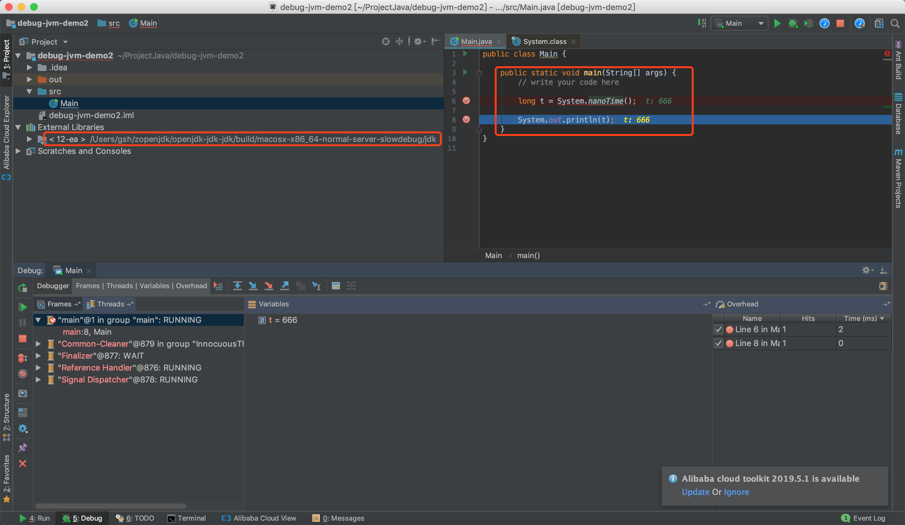
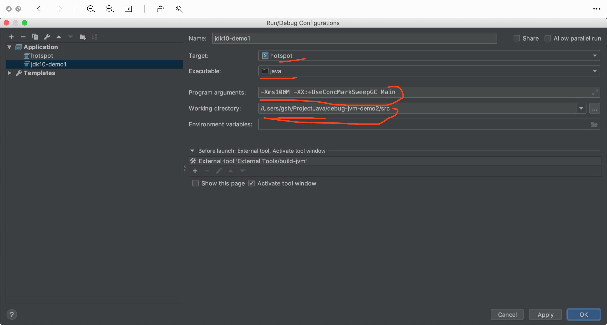
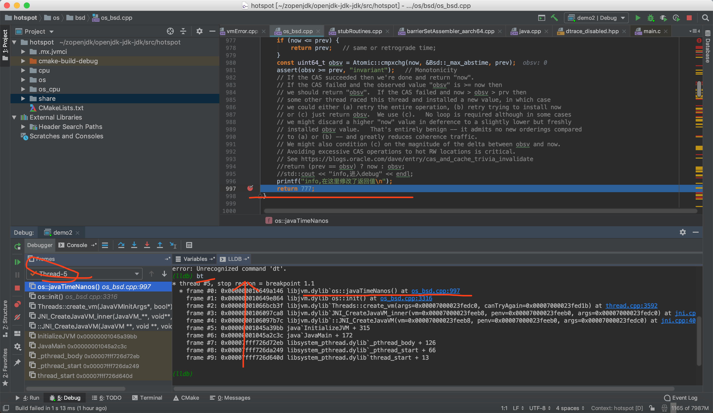
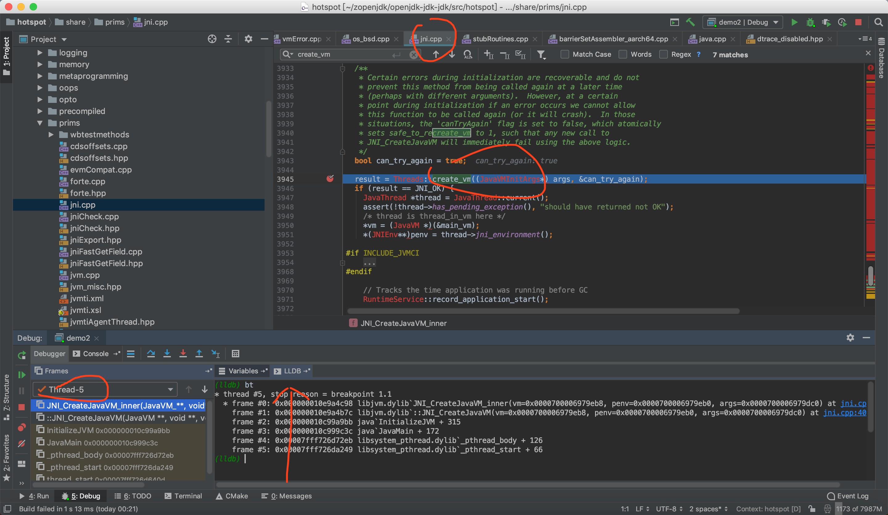

# 一个小的案例 验证可以调试 jdk

参考链接

[mac下编译openjdk1.9及集成clion动态调试](https://www.jianshu.com/p/ee7e9176632c)

修改 jdk 源码 编译之后测试

用他的方法调试 jdk 10

1 构建java项目
```
public class Main {

    public static void main(String[] args) {
        // write your code here
        System.out.println(System.nanoTime());
    }
}
```
在 idea 中debug



在 clion 中debug

设置参数


开始调试

-Xms100M -XX:+UseConcMarkSweepGC Main

/Users/gsh/ProjectJava/debug-jvm-demo2/

在clion中 修改源代码的地方 设置 b


虚拟机启动的地方


