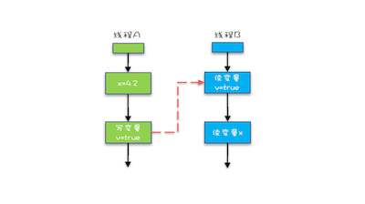

## java 内存模型

1 可见性和有序性 是 缓存和编译优化产生的， 那么就可以禁用缓存和编译优化来解决，但是如果完全禁止会对性能产生影响，  
那么就可以按照需求来禁止

从程序员的视角看 volatile ，synchronize， final  和 happen-before 规则

> java内存模型的本质就是规范了JVM如何提供禁用缓存和和编译器优化的方法；禁用缓存就是，直接操作内存，这样其他线程就对这个线程对这个变量的操作
可见，禁用编译器优化就是，代码的顺序就是执行的顺序，不会造成之后的先执行从而影响前边的结果


#### happen-before 六项规则

1 程序的顺序规则：程序前边某个变量的修改对后边一定是可见的  

2 volatile 变量规则 一个对volatile变量的写操作 happen-before 对这个变量的读操作  

3 传递性  


volatile 解决了缓存中变量发生变化后不可见的问题，解决了可见性的问题  

4 管程中的锁规则 synchronized 是java对管程的实现  

5 线程start（） start操作 happen-before B线程中的任何操作  
```$xslt
Thread B = new Thread(()->{
  // 主线程调用 B.start() 之前
  // 所有对共享变量的修改，此处皆可见
  // 此例中，var==77
});
// 此处对共享变量 var 修改
var = 77;
// 主线程启动子线程
B.start();
```

6  线程join（）操作  
在A线程中等待线程B完成 当B完成后 A能看到B的操作 
> B中的操作 happen-befor 与该join（）操作的返回

```$xslt
Thread B = new Thread(()->{
  // 此处对共享变量 var 修改
  var = 66;
});
// 例如此处对共享变量修改，
// 则这个修改结果对线程 B 可见
// 主线程启动子线程
B.start();
B.join()
// 子线程所有对共享变量的修改
// 在主线程调用 B.join() 之后皆可见
// 此例中，var==66
```

#### final

final 修饰的变量编译器可以尽量的优化


