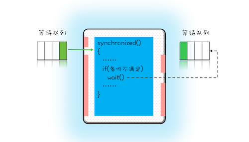
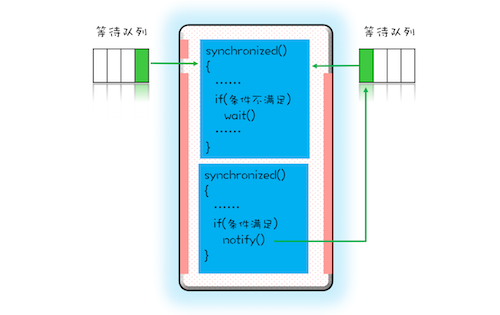

## 等待通知策略 优化死锁

在医院看病的流程就是等待和通知

1 挂号之后进入等待
2 通知轮到你的号的时候去看大夫

这样就能保证大夫在同一时间给一个病人看病， 也就是排队机制

> 一个完整的等待通知机制：线程首先获取互斥锁，对锁进行判断，如果条件不满足，就释放锁，进入等待队列，当要求满足的时候
 ，通知等待队列，这时候等地队列的第一个人重新获取锁，这时候他就能拿到互斥锁  
 
 
 Synchronized 中的 wait() notify() notifyall() 三个方法就可以实现
 
  
  
*等待队列和互斥锁是一对一出现的，每一个互斥锁都有自己的等待队列*





_wait()、notify()、notifyAll() 这三个方法能够被调用的前提是已经获取了相应的互斥锁，
所以我们会发现 wait()、notify()、notifyAll() 都是在 synchronized{}内部被调用的_


如果在 synchronized{}外部调用，或者锁定的 this，
而用 target.wait() 调用的话，JVM 会抛出一个运行时异常：java.lang.IllegalMonitorStateException


#### 尽量使用 notifyAll()

notifyAll() 来实现通知机制，
为什么不使用 notify() 呢？这二者是有区别的，notify() 是会随机地通知等待队列中的一个线程，
而 notifyAll() 会通知等待队列中的所有线程。从感觉上来讲，应该是 notify() 更好一些，因为即便通知所有线程，
也只有一个线程能够进入临界区。但那所谓的感觉往往都蕴藏着风险，
实际上使用 notify() 也很有风险，它的风险在于可能导致某些线程永远不会被通知到。


#### eg. 解决一次性申请账户转入转出的问题

1 互斥锁 this作为互斥锁
2 线程要求条件 转出账户和转入账户都没有被分配过
3 何时等待
4 何时通知

```
class Allocator {

    private List<Object> als;
    synchronized void apply(Object from, Object to){
        while(als.contains(from)||als.contains(to){
        try{
            wait();
            }
        }
        catch(Exception e){}
        als.add(from);
        als.add(to);
     }
     
     synchronized void free(Object from ,Object to){
        als.remove(from);
        als.remove(to);
     }
    
    
}
```
 
 
 
 
 
 
 
 
 
 
 
 
 
 
 
 
 
 
 
 
 
 
 
 
 
 
 
 
 
 
 
 
 
 
 
 
 