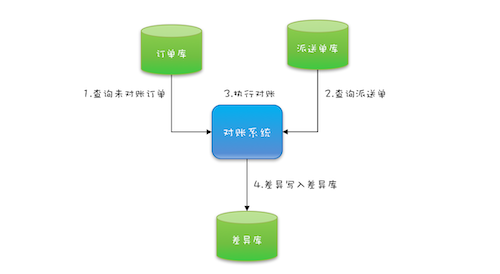

## CountDownLatch CyclicBarrier 



```$xslt
while(存在未对账订单){

// 查询未对账订单
pso = getPOrder();

// 查询派送单
dos = getDorder();

// 执行对账操作
diff = check(pos,dos);

// 差异写入差异库
save(diff);

}
``` 

```$xslt
while(存在未对账订单){

    Thread T1 = new Thread(()->{
        pos = getPOrders();
    });
    T1.start();
    
    Thread T2 = new Thread(()->{
        dos = getDOrders();
    });
    T2.start;
    
    T1.join();
    T2.join();
    
    diff = check(pos,dos);

    save(diff);

}

```


```$xslt

Excutor exextor = Exector.newFixedThreadPool(2);

while(存在未对账的订单){

CountDownLatch latch = new CountDownLatch(2);

exexctor.exectue(()->{
    pos = getPorder();
    latch.countDown;
});

exector.exectue(()->{
    dos = getDorder();
    latch.countDown();
});

latch.await();

diff = check(pos,dos);

save(diff);
    
}

```


###进一步优化性能


CyclicBarrier 是一组线程之间互相等待，更像是几个驴友之间不离不弃。
除此之外 CountDownLatch 的计数器是不能循环利用的，也就是说一旦计数器减到 0，
再有线程调用 await()，该线程会直接通过。但CyclicBarrier 的计数器是可以循环利用的，而且具备自动重置的功能，
一旦计数器减到 0 会自动重置到你设置的初始值。除此之外，CyclicBarrier 还可以设置回调函数，可以说是功能丰富


```$xslt
Vector(P) pos;
Vector(D) dos;

Excutor excutor = Excutor.newFixedThreadPool(1);

final CyclicBarrier barrier =  new CyclicBarrier(2,()->{
    executor.execute(()->check());
});


void check(){
  P p = pos.remove(0);
  D d = dos.remove(0);
  // 执行对账操作
  diff = check(p, d);
  // 差异写入差异库
  save(diff);
}


void checkAll(){
  // 循环查询订单库
  Thread T1 = new Thread(()->{
    while(存在未对账订单){
      // 查询订单库
      pos.add(getPOrders());
      // 等待
      barrier.await();
    }
  }
  T1.start();  
  // 循环查询运单库
  Thread T2 = new Thread(()->{
    while(存在未对账订单){
      // 查询运单库
      dos.add(getDOrders());
      // 等待
      barrier.await();
    }
  }
  T2.start();
}

```


