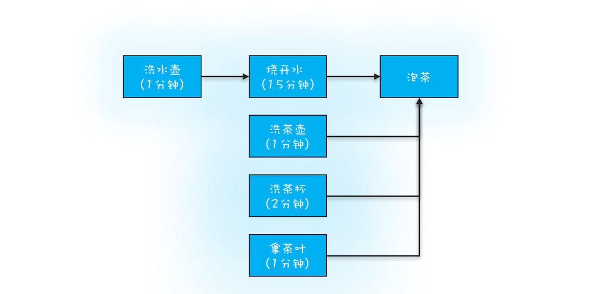

如何获取任务执行结果

```
// 提交Runnable任务
Future<?> 
  submit(Runnable task);
// 提交Callable任务
<T> Future<T> 
  submit(Callable<T> task);
// 提交Runnable任务及结果引用  
<T> Future<T> 
  submit(Runnable task, T result);
```


``` 
// 取消任务
boolean cancel(
  boolean mayInterruptIfRunning);
// 判断任务是否已取消  
boolean isCancelled();
// 判断任务是否已结束
boolean isDone();
// 获得任务执行结果
get();
// 获得任务执行结果，支持超时
get(long timeout, TimeUnit unit);

// 这两个get()方法都是阻塞式的，如果被调用的时候，任务还没有执行完，那么调用get()方法的线程会阻塞，直到任务执行完才会被唤醒。 
// 异步转同步

```


####  
<T> Future<T> 
  submit(Runnable task, T result);

```  

ExecutorService executor 
  = Executors.newFixedThreadPool(1);
// 创建Result对象r
Result r = new Result();
r.setAAA(a);
// 提交任务
Future<Result> future = 
  executor.submit(new Task(r), r);  
Result fr = future.get();
// 下面等式成立
fr === r;
fr.getAAA() === a;
fr.getXXX() === x

class Task implements Runnable{
  Result r;
  //通过构造函数传入result
  Task(Result r){
    this.r = r;
  }
  void run() {
    //可以操作result
    a = r.getAAA();
    r.setXXX(x);
  }
}
```
> result对象 作为参数，同时作为返回值，可以设置值，可以读取值，使变得非常灵活， 就像是一个全局变量

``` 
// 创建FutureTask
FutureTask<Integer> futureTask
  = new FutureTask<>(()-> 1+2);
// 创建线程池
ExecutorService es = 
  Executors.newCachedThreadPool();
// 提交FutureTask 
es.submit(futureTask);
// 获取计算结果
Integer result = futureTask.get(); 
```
> get 是阻塞的 就是 异步转同步了。

```
// 创建FutureTask
FutureTask<Integer> futureTask
  = new FutureTask<>(()-> 1+2);
// 创建并启动线程
Thread T1 = new Thread(futureTask);
T1.start();
// 获取计算结果
Integer result = futureTask.get();
```


#### 烧水泡茶

   


并发编程可以总结为三个核心问题：分工、同步和互斥。  
编写并发程序，首先要做的就是*分工*，所谓分工指的是如何高效地拆解任务并分配给线程。


```   


// 创建任务T2的FutureTask
FutureTask<String> ft2
  = new FutureTask<>(new T2Task());
// 创建任务T1的FutureTask
FutureTask<String> ft1
  = new FutureTask<>(new T1Task(ft2));
// 线程T1执行任务ft1
Thread T1 = new Thread(ft1);
T1.start();
// 线程T2执行任务ft2
Thread T2 = new Thread(ft2);
T2.start();
// 等待线程T1执行结果
System.out.println(ft1.get());

// T1Task需要执行的任务：
// 洗水壶、烧开水、泡茶
class T1Task implements Callable<String>{
  FutureTask<String> ft2;
  // T1任务需要T2任务的FutureTask
  T1Task(FutureTask<String> ft2){
    this.ft2 = ft2;
  }
  @Override
  String call() throws Exception {
    System.out.println("T1:洗水壶...");
    TimeUnit.SECONDS.sleep(1);
    
    System.out.println("T1:烧开水...");
    TimeUnit.SECONDS.sleep(15);
    // 获取T2线程的茶叶  
    String tf = ft2.get();
    System.out.println("T1:拿到茶叶:"+tf);

    System.out.println("T1:泡茶...");
    return "上茶:" + tf;
  }
}
// T2Task需要执行的任务:
// 洗茶壶、洗茶杯、拿茶叶
class T2Task implements Callable<String> {
  @Override
  String call() throws Exception {
    System.out.println("T2:洗茶壶...");
    TimeUnit.SECONDS.sleep(1);

    System.out.println("T2:洗茶杯...");
    TimeUnit.SECONDS.sleep(2);

    System.out.println("T2:拿茶叶...");
    TimeUnit.SECONDS.sleep(1);
    return "龙井";
  }
}
// 一次执行结果：
T1:洗水壶...
T2:洗茶壶...
T1:烧开水...
T2:洗茶杯...
T2:拿茶叶...
T1:拿到茶叶:龙井
T1:泡茶...
上茶:龙井


```


####   

利用多线程可以快速将一些串行的任务并行化，从而提高性能；如果任务之间有依赖关系，
比如当前任务依赖前一个任务的执行结果，这种问题基本上都可以用Future来解决。
在分析这种问题的过程中，建议你用有向图描述一下任务之间的依赖关系，同时将线程的分工也做好，
类似于烧水泡茶最优分工方案那幅图。对照图来写代码，好处是更形象，且不易出错。


