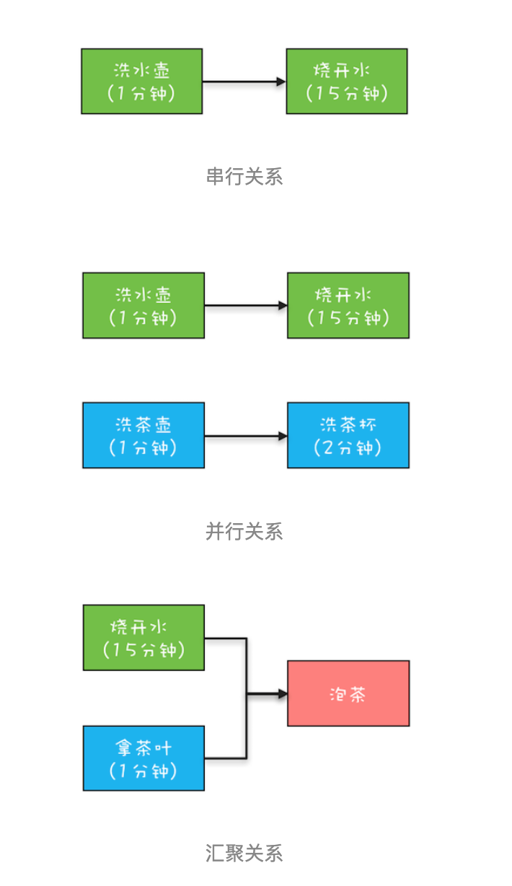

前面我们不止一次提到，用多线程优化性能，其实不过就是将串行操作变成并行操作。如果仔细观察，
你还会发现在串行转换成并行的过程中，一定会涉及到**异步化**  


异步化，是并行方案得以实施的基础，更深入地讲其实就是：利用多线程优化性能这个核心方案得以实施的基础   

Java在1.8版本提供了CompletableFuture来支持异步编程，CompletableFuture有可能是你见过的最复杂的工具类了，不过功能也着实让人感到震撼。  


>  并发编程 就是任务 分解到不同的线程中 ，二这个执行过程会产生 异步  就是完成的时间不同 ，同时在这个过程中 会产生依赖 ，countdownluatch
等可以解决依赖 samephore 解决并发 ，线程池提高资源利用率 ，一些上层的封装简化 编程

```  

//任务1：洗水壶->烧开水
CompletableFuture<Void> f1 = 
  CompletableFuture.runAsync(()->{
  System.out.println("T1:洗水壶...");
  sleep(1, TimeUnit.SECONDS);

  System.out.println("T1:烧开水...");
  sleep(15, TimeUnit.SECONDS);
});
//任务2：洗茶壶->洗茶杯->拿茶叶
CompletableFuture<String> f2 = 
  CompletableFuture.supplyAsync(()->{
  System.out.println("T2:洗茶壶...");
  sleep(1, TimeUnit.SECONDS);

  System.out.println("T2:洗茶杯...");
  sleep(2, TimeUnit.SECONDS);

  System.out.println("T2:拿茶叶...");
  sleep(1, TimeUnit.SECONDS);
  return "龙井";
});
//任务3：任务1和任务2完成后执行：泡茶
CompletableFuture<String> f3 = 
  f1.thenCombine(f2, (__, tf)->{
    System.out.println("T1:拿到茶叶:" + tf);
    System.out.println("T1:泡茶...");
    return "上茶:" + tf;
  });
//等待任务3执行结果
System.out.println(f3.join());

void sleep(int t, TimeUnit u) {
  try {
    u.sleep(t);
  }catch(InterruptedException e){}
}
// 一次执行结果：
T1:洗水壶...
T2:洗茶壶...
T1:烧开水...
T2:洗茶杯...
T2:拿茶叶...
T1:拿到茶叶:龙井
T1:泡茶...
上茶:龙井

```


>  强烈建议你要根据不同的业务类型创建不同的线程池，以避免互相干扰。


**对于一个异步操作，你需要关注两个问题：一个是异步操作什么时候结束，
另一个是如何获取异步操作的执行结果**   

因为CompletableFuture类实现了Future接口，所以这两个问题你都可以通过Future接口来解决。另外，
CompletableFuture类还实现了CompletionStage接口，这个接口内容实在是太丰富了，在1.8版本里有40个方法，这些方法我们该如何理解呢？  


####  如何理解CompletionStage接口


任务是有时序关系的，比如有串行关系、并行关系、汇聚关系等。



CompletionStage接口可以清晰地描述任务之间的这种时序关系，例如前面提到的 f3 = f1.thenCombine(f2, ()->{}) 
描述的就是一种汇聚关系。烧水泡茶程序中的汇聚关系是一种 AND 聚合关系，
这里的AND指的是所有依赖的任务（烧开水和拿茶叶）都完成后才开始执行当前任务（泡茶）。
> 既然有AND聚合关系，那就一定还有OR聚合关系，所谓OR指的是依赖的任务只要有一个完成就可以执行当前任务。


#### 串行关系的接口
CompletionStage接口里面描述串行关系，主要是thenApply、thenAccept、thenRun和thenCompose这四个系列的接口。

thenApply  
这个接口里与CompletionStage相关的方法是 R apply(T t)，这个方法既能接收参数也支持返回值，所以thenApply系列方法返回的是CompletionStage<R>。   

thenAccept  
系列方法里参数consumer的类型是接口Consumer<T>，这个接口里与CompletionStage相关的方法是 void accept(T t)，
这个方法虽然支持参数，但却不支持回值，所以thenAccept系列方法返回的是CompletionStage<Void>。

thrnRun  
thenRun系列方法里action的参数是Runnable，所以action既不能接收参数也不支持返回值，所以thenRun系列方法返回的也是CompletionStage<Void>。  

这些方法里面Async代表的是异步执行fn、consumer或者action

``` 
CompletableFuture<String> f0 = 
  CompletableFuture.supplyAsync(
    () -> "Hello World")      //①
  .thenApply(s -> s + " QQ")  //②
  .thenApply(String::toUpperCase);//③

System.out.println(f0.join());
//输出结果
HELLO WORLD QQ
```


#### and汇聚关系

CompletionStage接口里面描述AND汇聚关系，主要是thenCombine、thenAcceptBoth和runAfterBoth系列的接口，
这些接口的区别也是源自fn、consumer、action这三个核心参数不同。它们的使用你可以参考上面烧水泡茶的实现程序，这里就不赘述了。   
```  
CompletionStage<R> thenCombine(other, fn);
CompletionStage<R> thenCombineAsync(other, fn);
CompletionStage<Void> thenAcceptBoth(other, consumer);
CompletionStage<Void> thenAcceptBothAsync(other, consumer);
CompletionStage<Void> runAfterBoth(other, action);
CompletionStage<Void> runAfterBothAsync(other, action);
```


#### or汇聚关系

CompletionStage接口里面描述OR汇聚关系，主要是applyToEither、acceptEither和runAfterEither系列的接口，
这些接口的区别也是源自fn、consumer、action这三个核心参数不同。

```  
CompletionStage applyToEither(other, fn);
CompletionStage applyToEitherAsync(other, fn);
CompletionStage acceptEither(other, consumer);
CompletionStage acceptEitherAsync(other, consumer);
CompletionStage runAfterEither(other, action);
CompletionStage runAfterEitherAsync(other, action);

```
```  
CompletableFuture<String> f1 = 
  CompletableFuture.supplyAsync(()->{
    int t = getRandom(5, 10);
    sleep(t, TimeUnit.SECONDS);
    return String.valueOf(t);
});

CompletableFuture<String> f1 = 
  CompletableFuture.supplyAsync(()->{
    int t = getRandom(5, 10);
    sleep(t, TimeUnit.SECONDS);
    return String.valueOf(t);
});

CompletableFuture<String> f3 = 
  f1.applyToEither(f2,s -> s);

System.out.println(f3.join());

```


### 4. 异常处理

虽然上面我们提到的fn、consumer、action它们的核心方法都不允许抛出可检查异常，但是却无法限制它们抛出运行时异常

```   
CompletionStage exceptionally(fn);
CompletionStage<R> whenComplete(consumer);
CompletionStage<R> whenCompleteAsync(consumer);
CompletionStage<R> handle(fn);
CompletionStage<R> handleAsync(fn);

```
下面的示例代码展示了如何使用exceptionally()方法来处理异常，exceptionally()的使用非常类似于try{}catch{}中的catch{}，
但是由于支持链式编程方式，所以相对更简单。既然有try{}catch{}，那就一定还有try{}finally{}，
whenComplete()和handle()系列方法就类似于try{}finally{}中的finally{}，
无论是否发生异常都会执行whenComplete()中的回调函数consumer和handle()中的回调函数fn。
whenComplete()和handle()的区别在于whenComplete()不支持返回结果，而handle()是支持返回结果的。  


```  
CompletableFuture<Integer> 
  f0 = CompletableFuture
    .supplyAsync(()->7/0))
    .thenApply(r->r*10)
    .exceptionally(e->0);
System.out.println(f0.join());
```


#### 总结  

曾经一提到异步编程，大家脑海里都会随之浮现回调函数，例如在JavaScript里面异步问题基本上都是靠回调函数来解决的，
回调函数在处理异常以及复杂的异步任务关系时往往力不从心，对此业界还发明了个名词：回调地狱（Callback Hell）。
应该说在前些年，异步编程还是声名狼藉的。

不过最近几年，伴随着ReactiveX的发展（Java语言的实现版本是RxJava），回调地狱已经被完美解决了，异步编程已经慢慢开始成熟，
Java语言也开始官方支持异步编程：在1.8版本提供了CompletableFuture，在Java 9版本则提供了更加完备的Flow API，
异步编程目前已经完全工业化。因此，学好异步编程还是很有必要的。

CompletableFuture已经能够满足简单的异步编程需求，如果你对异步编程感兴趣，可以重点关注RxJava这个项目，利用RxJava，
即便在Java 1.6版本也能享受异步编程的乐趣。


