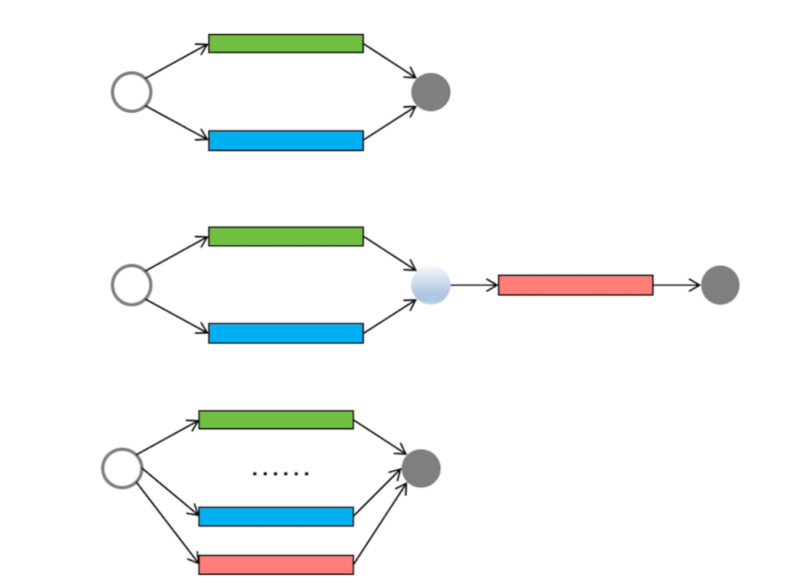
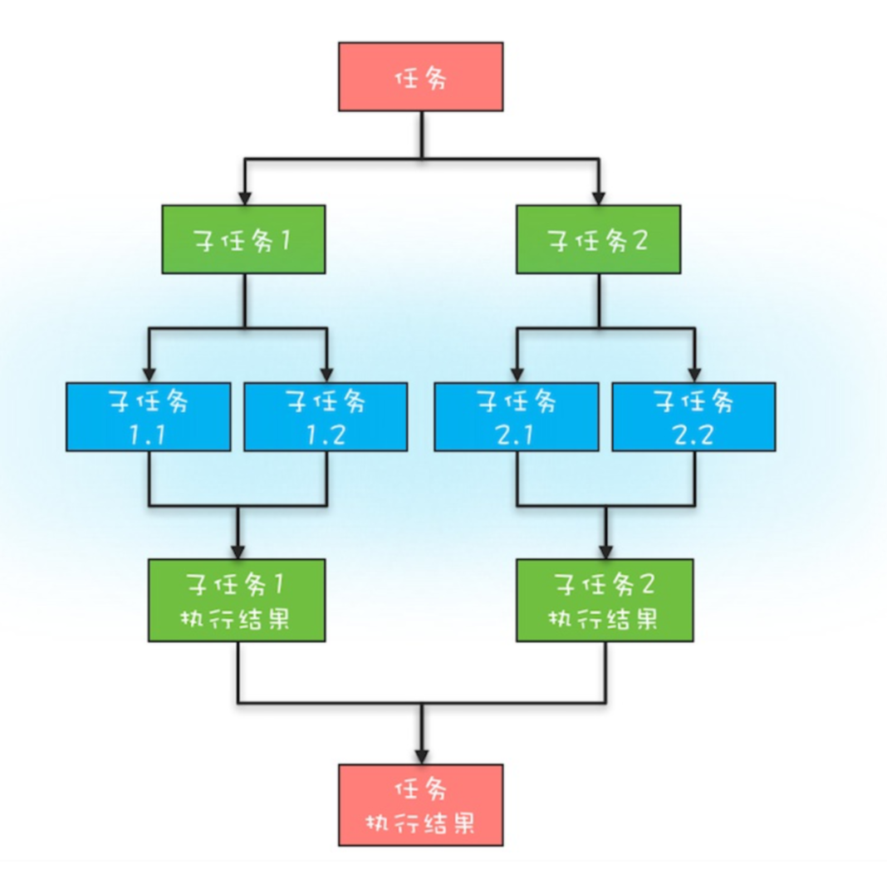
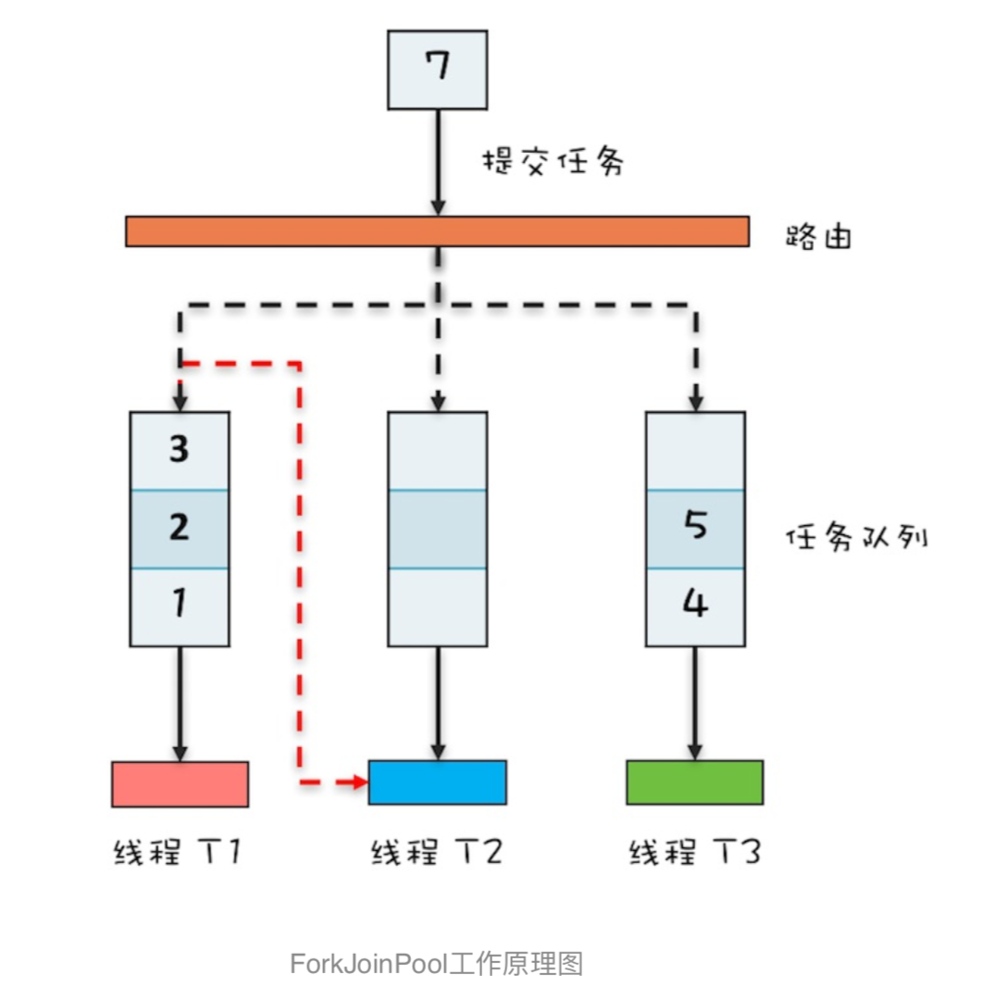

细观察你会发现这些工具类都是在帮 助我们站在**任务**的视⻆来解决并发问题，
而不是让我们纠缠在线程之间如何协作的细节上(比如线程之间如何实现等待、通知 等)。
对于简单的并行任务，你可以通过“线程池+Future”的方案来解决;如果任务之间有聚合关系，
无论是AND聚合还是 OR聚合，都可以通过CompletableFuture来解决;
而批量的并行任务，则可以通过CompletionService来解决。



从上到下，依次为简单并行任务、聚合任务和批量并行任务示意图


#### 分治，顾名思义，即分而治之，
是一种解决复杂问题的思维方法和模式;具体来讲，
指 的是把一个复杂的问题分解成多个相似的子问题，然后再把子问题分解成更小的子问题，
直到子问题简单到可以直接求解。理 论上来讲，解决每一个问题都对应着一个任务，所以对于问题的分治，实际上就是对于任务的分治。





####  Fork/Join的使用

Fork/Join计算框架主要包含两部分，一部分是分治任务的线程池ForkJoinPool，另一部分 是分治任务ForkJoinTask。

这两部分的关系类似于ThreadPoolExecutor和Runnable的关系，都可以理解为提交任务到线程 池，只不过分治任务有自己独特类型ForkJoinTask。

```  
static void main(String[] args){ //创建分治任务线程池
ForkJoinPool fjp =
new ForkJoinPool(4); //创建分治任务
Fibonacci fib =
new Fibonacci(30); //启动分治任务
Integer result =
fjp.invoke(fib); //输出结果 System.out.println(result);
}
//递归任务
static class Fibonacci extends
RecursiveTask<Integer>{ final int n;
Fibonacci(int n){this.n = n;} protected Integer compute(){
    if (n <= 1)
      return n;
    Fibonacci f1 =
      new Fibonacci(n - 1);
//创建子任务 f1.fork(); Fibonacci f2 =
new Fibonacci(n - 2); //等待子任务结果，并合并结果
return f2.compute() + f1.join();
} }

```


###  ForkJoinPool工作原理

ThreadPoolExecutor内部只有一个任务队列，而ForkJoinPool内部有多个任务队列，当我们通过ForkJoinPool的invoke() 或者submit()方法提交任务时，
ForkJoinPool根据一定的路由规则把任务提交到一个任务队列中，如果任务在执行过程中会创 建出子任务，那么子任务会提交到工作线程对应的任务队列中。   




ForkJoinPool支持一种叫做“任务窃取”的机制，如果工 作线程空闲了，那它可以“窃取”其他工作任务队列里的任务   


>  建议用不同的ForkJoinPool执行不同类型的计算任务


