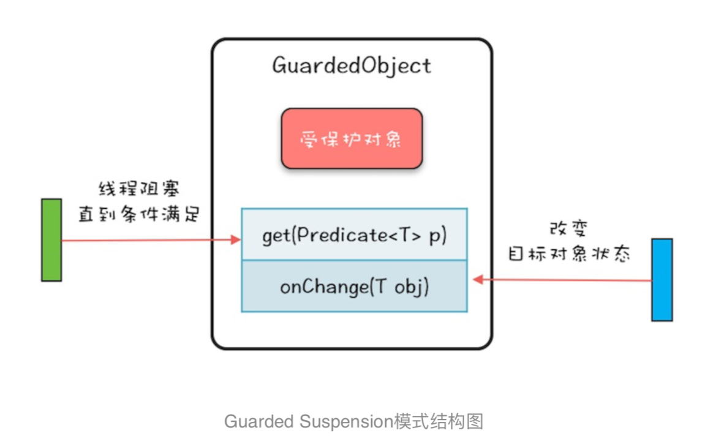

###

Guarded Suspension。所谓Guarded Suspension，直译过来就是“保护性地暂停”。  

   

GuardedObject的内部实现非常简单，是管程的一个经典用法，你可以参考下面的示例代码，核心是:get()方法通过条件变量
的await()方法实现等待，onChanged()方法通过条件变量的signalAll()方法实现唤醒功能。逻辑还是很简单的，所以这里就不 再详细介绍了。  


``` 
class GuardedObject<T>{ //受保护的对象
T obj;
final Lock lock =
new ReentrantLock(); final Condition done = lock.newCondition();
final int timeout=1; //获取受保护对象
T get(Predicate<T> p) {
    lock.lock();
    try {
//MESA管程推荐写法 while(!p.test(obj)){
done.await(timeout, TimeUnit.SECONDS);
}
}catch(InterruptedException e){
throw new RuntimeException(e); }finally{
      lock.unlock();
    }
//返回非空的受保护对象
return obj; }
//事件通知方法
void onChanged(T obj) {
    lock.lock();
    try {
      this.obj = obj;
done.signalAll(); } finally {
      lock.unlock();
    }
} }

```


### 总结
Guarded Suspension模式本质上是一种等待唤醒机制的实现，只不过Guarded Suspension模式将其规范化了。
范化的好处 是你无需重头思考如何实现，也无需担心实现程序的可理解性问题，
同时也能避免一不小心写出个Bug来。但Guarded Suspension模式在解决实际问题的时候，往往还是需要扩展的，
扩展的方式有很多，本篇文章就直接对GuardedObject的功能 进行了增强，Dubbo中DefaultFuture这个类也是采用的这种方式，
你可以对比着来看，相信对DefaultFuture的实现原理会理解 得更透彻。当然，你也可以创建新的类来实现对Guarded Suspension模式的扩展。
Guarded Suspension模式也常被称作Guarded Wait模式、Spin Lock模式(因为使用了while循环去等待)，这些名字都很形 象，
不过它还有一个更形象的非官方名字:多线程版本的if。单线程场景中，if语句是不需要等待的，因为在只有一个线程的条 件下，
如果这个线程被阻塞，那就没有其他活动线程了，这意味着if判断条件的结果也不会发生变化了。但是多线程场景中， 等待就变得有意义了，
这种场景下，if判断条件的结果是可能发生变化的。所以，用“多线程版本的if”来理解这个模式会更简 单。