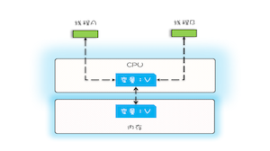
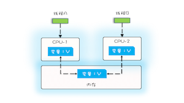
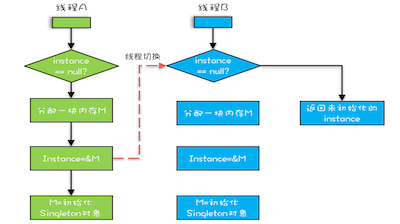

## 可见性 原子性  有序性

#### 来源

cpu ，mem ， io 三者的速度差异是 1cpu添加缓存，2操作系统添加进程线程，3 编译原理修改执行顺序 帮助我们平衡的

1 缓存导致可见性  
 
    
    单核和多核cpu 的缓存位置不同，会出现不可见性  

> 一个线程对变量的修改，对另外一个线程可见，我们叫做可见性

2 线程的切换带来的原子性问题

> 操作系统的任务切换可以发生在任何一个cpu指令执行完成  
  count =  5  和 count = count + 1  分别有几条指令  
  1 count 从内存中加载到cpu寄存器中  
  2 寄存器中执行+1  
  3 将结果写入内存

如果线程A 在第一步执行完之后 切换到线程B B执行完成在回到A count就加了两次


> 我们把一个或者多个操作在cpu中的执行过程中不被中断的特性叫做原子性


3 编译器优化带来的有序性问题

```
public class Singleton {
  static Singleton instance;
  static Singleton getInstance(){
    if (instance == null) {
      synchronized(Singleton.class) {
        if (instance == null)
          instance = new Singleton();
        }
    }
    return instance;
  }
}
```

new操作的执行顺序
1 分配内存m 2 在m上初始化 singleton对象 ，3 然后把m的地址赋值给instance  
编译器优化后的顺序为
1 分配m ， 2 m地址赋值给instance 3 在m上初始化 Singleton对象  
如果在第二步完成之后，线程进行了切换 ，那么第三步就不会在执行了，就会出现访问instance属性时候出现空指针




#### 总结

缓存，多线程，编译器优化都是我为了提高程序效率的方法，在引入这些方法的时候又产生了新的问题，在采用一项技术的同时，  
要清楚它会带来什么问题，以及如何规避


    