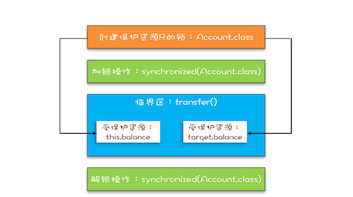

## 互斥锁 原子性问题

> 同一时刻只有一个线程执行 叫做互斥


  
我们通常能想到 加锁 解锁  的模型  
> 我们忽略的是我们 锁住的是什么， 我们保护的又是什么

改进后的锁模型
  
  

java中常用的synchronize用法
```$xslt
classX{
    synchronized void foo(){
        // 临界区
    }
    
    synchronized static void bar(){
        // 临界区
    }
    
    Object obj = new Object();
    void baz(){
    
        synchronized(obj){
            // 临界区
        }
        
    }
}
```

> 管程中的锁规则 解锁happen-before后续对这个锁的加锁  
---

> 受保护资源和锁的关系是N:1的关系  一把锁可以保护多个资源， 多把锁不能保护同一个资源


锁保护资源的确定

对比：  
```$xslt
class SafeCalc {
  long value = 0L;
  synchronized long get() {
    return value;
  }
  synchronized void addOne() {
    value += 1;
  }
}
```


都是 this 锁 可以保护同一块资源 解决原子性问题

```$xslt
class SafeCalc {
  static long value = 0L;
  synchronized long get() {
    return value;
  }
  synchronized static void addOne() {
    value += 1;
  }
}
```
   
 
 一个是对象锁，一个是类锁 保护的资源不一致


#### 总结
synchronized 是 java里提供锁的语义

锁一定要有有个锁住额对象，锁定的对象要锁住的资源和在哪里加解锁就是设计层面的事情了


## 互斥锁（下） 如何用一把锁保护多个资源

#### 保护没有关联关系的多个资源

1 创建两个锁 ， 各自管理各自的资源
```$xslt
class Account {
  // 锁：保护账户余额
  private final Object balLock
    = new Object();
  // 账户余额  
  private Integer balance;
  // 锁：保护账户密码
  private final Object pwLock
    = new Object();
  // 账户密码
  private String password;
 
  // 取款
  void withdraw(Integer amt) {
    synchronized(balLock) {
      if (this.balance > amt){
        this.balance -= amt;
      }
    }
  } 
  // 查看余额
  Integer getBalance() {
    synchronized(balLock) {
      return balance;
    }
  }
 
  // 更改密码
  void updatePassword(String pw){
    synchronized(pwLock) {
      this.password = pw;
    }
  } 
  // 查看密码
  String getPassword() {
    synchronized(pwLock) {
      return password;
    }
  }
}
``` 

> 用不同的锁对受保护的资源进行精细化管理，能够提升性能，这种锁还有个名字叫做细粒度锁  


#### 保护有关联关系的多个资源

多个资源是有关联关系的， 那么就有点复杂了，例如银行里边的转账操作，a减少100，b增加100

```$xslt

class Account{

private int blance;

synchronized void transfer(Account target, int amt){

    if(this.blance > amt){
        this.blance -= amt;
        target.blance += amt;
    
    }
}

}

```  
这样只是给 this 加了对象锁 ，tagget对象并没有枷锁 target.blance 并没有得到保护，自家的锁保护别人家的资产


##### 正确使用锁的方法

用类锁作为共享锁 
```$xslt
class Account {
  private int balance;
  // 转账
  void transfer(Account target, int amt){
    synchronized(Account.class) {
      if (this.balance > amt) {
        this.balance -= amt;
        target.balance += amt;
      }
    }
  } 
}
```




### 总结

互斥锁 和 共享锁 在mysql中也有体现，归根到底就是为了保护原子性 ，也有锁的粒度问题，锁的粒度越细，并发控制的就越好，但是使用起来也会越
麻烦，还会产生死锁的问题  
原子性，面向cpu就是指令操作，面向高级语言就是转账操作。

原子性问题就是要保证中间状态对外不可见。原子性的本质其实不是不可分割，其本质是保证多个资源之间的一致性要求，操作中间状态对外不可见。


