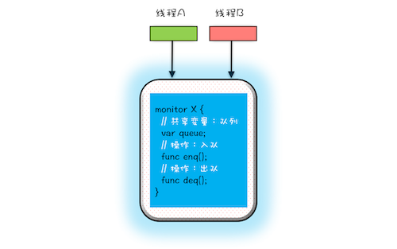

## 万能钥匙

管程：（Minitor）  
管程和信号量是等价的，等价是指用管程可以实现信号量，也可以用信号量实现管程   

管程就是管理共享变量以及对共享变量的操作过程，就是让他们支持并发。java中就是管理类的成员方法和成员变量  


MWSA模型  
并发问题 一个是互斥 一个是同步  
互斥  
  
只允许一个线程进入管程   


同步  
  

管程里还引入了条件变量的概念，每个条件变量都对应一个等待队列  

1 对于入队操作，如果队列已满，就需要等待直到队列不满，notFull.await()  
2 对于出队操作，如果队列为空，就要等待直到队列不空， notEmpty.await()  
3 如果入队成功，那么队列就不空了，就需要通知条件变量：队列不空notEmpty对用的等待队列  
4 如果出队成功，那么队列就不满了，就需要通知条件变量：队列不满notFull对应的等待队列  

```
public class BlockedQueue<T>{
    final Lock lock = new ReentrantLock();
    // 条件变量 对列不满
    final Condition notfull = lock.newCondition();
    // 条件变量 队列不空
    final Condition notEmpty =  lock.newCondition();
    
    //入队
    void enq(T x){
        lock.lock();
        try{
            // ~.~  这个循环 队列满了就不能 继续入了 
            while(队列已满){
                notFull.await();  //  就进入这个循环一直等 等出队的门卫告诉你 对列空了
            }
              // 等到有人出队列的时候发来消息 这时候对垒不满 可以入队了
            
            //入队后可通知出队
            notEmpty.signal();
        }finaly{
            lock.unlock();
        }
    }

    // 出队
    void deq(){
        lock.lock();
        try{
        
               // ~.~ 队列已经空了 没有东西可以出队列了
            while(队列已空){
                notEmpty.await();  // 等 一直等到队列有人了
            }
            //出队后可通知入队   // 出队之后要发出通知 告诉别人队列又有位置了 可以入队了
            notFull.signal();
        }fainaly{
            lock.unlock;
        }
    }
}

```

###### 自己的理解
（有连个队列 一个是入口等待队列 就是等待进入看病的病人 ，这时候这个人还没有见过医生
还有一个条件等待队列， 这个人已经进入管程，但是条件队列还是空的， 这个人见过医生，医生让他去验血， 他就进入了条件等待队列
这时候医生是空的，下一个人就可以进诊室了，这时候医生让第二个人去验血，这时候这个人就进入验血对列，这是由验血对列里有两个人了
这时候医生就又空了，这时候就要看验血队列是否满了，如果验血的对列没有满，这时候医生还是可以让第三个病人进来看病， 让后让第三个人去验血队列
这个时候如果第一个人已经好了，这时候入口队列就关闭了，医生让第三个人去验血队列之后，就让第一个人从验血队列出来，给第一个人看完病之后，
这时候医生又空了，判断验血队列是否好了，如果没有好，就打开入口队列让第四个人进来， 如果第二个人好了，那么第四个人就不能进来， 要给第二个人
看病，看完之后继续重复判断验血队列是否为空或者是否有人已经验好学了，如果都没有就让第五个人进来。）

上边的逻辑自己都被绕晕了，说明问题的本质没有理解正确，需要在抽象一下：下边在举个例子

其实就是两个门卫 一个负责进的 一个负责出的  

当进的门卫发现已经满了，就不让进了  （阻塞）
当出的门卫发现已经空了，就不让出了  （阻塞）

那么进的门卫如果让进了，就会告诉出的门卫，有人进来了，你可以不用阻塞了，可以出了
如果出的门卫让出了， 就会告诉进的门卫， 可以让进了， 不用阻塞了


那么如果不满的时候呢 和不空的时候呢 进和出没有阻塞的时候呢

如果有人进 ，这时候进的门卫室怎么知道满了呢？ 判断队列是否为满，这时候就去查队列的初始值，他有怎么知道有多少人进了呢，判断队列现在的值，
那么是否有变量记录队列现在的值呢


#### wait() 的使用

> while(条件不满足){ wait(); }  


