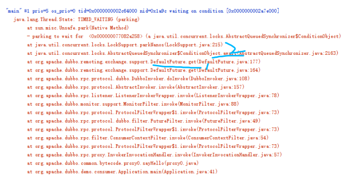

### Lock

重新设计一把互斥锁，要解决怎样的问题呢?  

1 能够响应终端：如果阻塞的线程能够响应中断信号， 那么当给阻塞线程发送终端信号的时候就能够唤醒他，
去释放资源  
2 支持超时： 如果一个线程在一段时间内没有获取到锁，就返回一个错误，而不是继续阻塞  
3 非阻塞的获取锁： 如果尝试获取锁失败，并不进入阻塞状态，而是直接返回  

Lock 的3个接口：
```$xslt
//支持终端API
void lockInterruptibly() throw InterruptedException;

// 支持超时的API
void tryLock(long time, TimeUnit unit) throw InterruptedException;

// 支持非阻塞的获取锁 的API
boolean tryLock（）；
```

如何保证可见性
```$xslt
class X{

    private final Lock rtl = new ReentranLock();
    
    int value;
    
    puvlic void addOne(){
        rtl.lock();
        try{
            value+=1;
        }
        finaly{
            trl.unlock();
        }
    }
    
}

```

java怎么实现的锁

```$xslt
class SampleLock{
    volatile int state;
    lock(){
        state = 1;
    }
    unlock(){
        state = 0;
    }
    
    
}
```


### 什么是重入锁
*线程可以重复获取同一把锁*

可重入函数：多个线程可以同时调用该函数， 每个线程都能够的到正确的结果；同时在一个
线程内只是线程切换，无论切换多少次，结果都是正确的，可重入函数式线程安全的。  

```$xslt
class X{
    private final Lock rtl = new ReentrantLock();
    int value;
    public int get(){
        rtl.lock();  // a2
        try{
        return value;
        }
        finaly{
            rtl.unlock();
        }
    }
    
    public void addOne(){
        rtl.lock();
        try{
            valuer = 1 + get(); //a1
        }
        finaly{
            trl.unlock;
        }
    }
    

}
```  
当T1执行到a1 的时候 会在 a2的地方执行枷锁，如果rtl不是可以重入的或者不是同一把锁，就
要阻塞，如果是同一把锁且可以重入，那么就T1就不会阻塞  


### 公平所与非公平锁
```$xslt
// 默认非公平

public ReentranLock(){
    sync = new NonfairSync();
}

publid ReentranLock(boolean fair){
    sync = fair ? new FariSync():
                    new NonfairSync();
}


```


#### 用锁的最佳实践

Doug Lea：  
> 1 永远只在更新队形的成员变量时加锁  
  2 永远只在访问可变的成员变量时枷锁  
  3 永远不在调用其他对象的方法时枷锁  
  减少锁的持有时间、减小锁的粒度等业界广为人知的规则，
  其实本质上它们都是相通的，不过是在该加锁的地方加锁而已


### Doubbo 是如何用管程实现异步转同步的


#####Dubbo 源码分析

TCP 协议本身就是异步的，我们工作中经常用到的 RPC 调用，在 TCP 协议层面，
发送完 RPC 请求后，线程是不会等待 RPC 的响应结果的。
可能你会觉得奇怪，平时工作中的 RPC 调用大多数都是同步的啊？这是怎么回事呢？


```$xslt
DemoService service = 初始化部分省略
String message = 
  service.sayHello("dubbo");
System.out.println(message);

```


 
在线程dump中 await方法前的一个栈方法是 DefaultFuture.get()  
```$xslt
public class DubboInvoke{
    Result doInvoke(Invoke inv){
    // line 108
    ...
    return currentClient
            .request(inv,timeout)
            .get());
    
    }
}
```
当RPC返回结果之前，阻塞调用线程，让调用线程等待；当RPC返回结果的时候， 唤醒线程，让调用线程
重新执行，这就是等待通知的机制  

```$xslt

private final  Lock lock = new ReentranLock();

private final  Condtion done = lock.newCondition();

Object get(int timeout){
    long start = System,nanoTime();
    lock.lock();
    try{
        while(!idDone()){
            done.await(timeout);
            long cur = System.nanoTime();
            if(isDone()||cur-start>timeout){
                break;
            }
        }
    }
    finaly{
        lock.unlock();
    }
    
    if(!isDone){
        throw new TimeoutException();
    }
    
    return returnFromResponse();
    
}


private isDone(){
    lock.lock();
    try{
        response = res;
        if(done!=null){
            done.singal();
        }
    }
    fainly{
        lock,unlock();
    }
}
```


