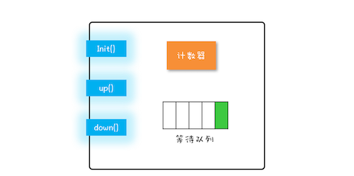

## Semaphore 信号量

计数器，等待队列，init(), down(),up()  



```$xslt
class Semphore{
    int count;
    Queue queue;
    Samephore(int c){
        this.count = c;
    }

    void down(){
        this.count--;
        if(this.count<0){
            //cur thread insert queue
            // cur thread block
        }
    }
    
    void up(){
        this.count++;
        if(this.count<=0){
            // del thread in queue
            // notify thread
        }
    }


}

```

### 限流器

```$xslt
class ObjPool<T, R>{
    final List<T> pool;
    final Semaphore sem;
    ObjPool(int size ,T t){
        pool = new Vector<T>();
        for (int i = 0;i<size ;i++){
            pool.add(t);
        }
        sem = new Semaphore(size);
    }
    
    R exec(Function<T,R> func){
        T t = null;
        sem.aqure();
        try{
            t = pool.remove(0);
            return func.apply(t);
        }
        finaly{
            pool.add(t);
            sem.release();
        }
    }
}

ObjPool<Long,String> pool = new BojPool<Long,String>(10,2);

pool.exec(t->{
            System.out.println(t);
            return t.toString();
        });

```


