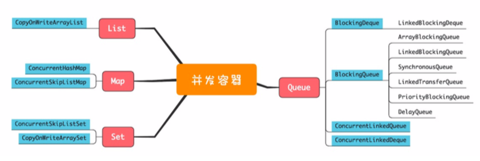

List、Map、Set和Queue ,stack  

在容器领域一个容易被忽视的“坑”是用迭代器遍历容器  

```$xslt
List list = Collections. synchronizedList(new ArrayList());
synchronized (list) {
Iterator i = list.iterator(); while (i.hasNext())
    foo(i.next());
}
```

  

(一)List   
List里面只有一个实现类就是CopyOnWriteArrayList。CopyOnWrite，顾名思义就是写的时候会将共享变量新复制一份出
来，这样做的好处是读操作完全无锁。   
CopyOnWriteArrayList是如何处理的呢?CopyOnWriteArrayList 会将array复制一份，然后在新复制处理的数组上执行增加元素的操作，
执行完之后再将array指向这个新的数组。
通过下图你 可以看到，读写是可以并行的，遍历操作一直都是基于原array执行，而写操作则是基于新array进行。  
CopyOnWriteArrayList仅适用于写操作非常少 的场景，而且能够容忍读写的短暂不一致    


(二)Map  
ConcurrentHashMap的key是无序的，而ConcurrentSkipListMap的key是有序的。   
，它们的key和value都不能为空，否则会抛 出NullPointerException这个运行时异常。  


ConcurrentSkipListMap里面的SkipList本身就是一种数据结构，中文一般都翻译为“跳表”。
跳表插入、删除、查询操作平均的 时间复杂度是 O(log n)，理论上和并发线程数没有关系，
所以在并发度非常高的情况下，若你对ConcurrentHashMap的性能 还不满意，可以尝试一下ConcurrentSkipListMap。  


(三)Set    
Set接口的两个实现是CopyOnWriteArraySet和ConcurrentSkipListSet，使用场景可以参考前面讲述的CopyOnWriteArrayList
和ConcurrentSkipListMap，它们的原理都是一样的，这里就不再赘述了。


(四)Queue 
1.单端阻塞队列:其实现有ArrayBlockingQueue、LinkedBlockingQueue、
SynchronousQueue、LinkedTransferQueue、 PriorityBlockingQueue和DelayQueue    

2.双端阻塞队列:其实现是LinkedBlockingDeque。   

3.单端非阻塞队列:其实现是ConcurrentLinkedQueue。    
 
4.双端非阻塞队列:其实现是ConcurrentLinkedDeque。


