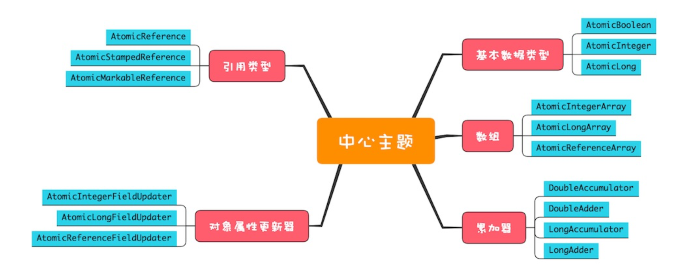

### 无锁方案的实现原理

cas 作为一条cpu指令，cas可以保证原子性  

`
只有当目前count的值和期望的expect相等时，才会将count更新为newvalue
`
> ；例如 count = 3  
        T1 执行 count++，T1期望的count值为4，
            这时候如果过count的值为4，cas就更新count在内存中的值
            加入这时候已经有T2线程把count的值改为了4，那么这时候count的值为5，与T1期望的4不同，那么久不更更新，在继续惊醒cas 直到更新成功
            
```
class SimulatedCAS{
int count; synchronized int cas(
int expect, int newValue){ // 读目前count的值
int curValue = count;
// 比较目前count值是否==期望值 if(curValue == expect){
// 如果是，则更新count的值
      count = newValue;
    }
// 返回写入前的值
    return curValue;
  }
}
``` 

### cas+自旋


### ABA问题

前面我们提到“如果cas(count,newValue)返回的值不等于count，意味着线程在执行完代码1处之后，执行代码2处之 前，
count的值被其他线程更新过”，那如果cas(count,newValue)返回的值等于count，
是否就能够认为count的值没有被其他线 程更新过呢?显然不是的，假设count原本是A，
线程T1在执行完代码1处之后，执行代码2处之前，有可能count被线程T2更 新成了B，之后又被T3更新回了A，
这样线程T1虽然看到的一直是A，但是其实已经被其他线程更新过了，这就是ABA问题。


  

总结
无锁方案相对于互斥锁方案，优点非常多，首先性能好，其次是基本不会出现死锁问题(但可能出现饥饿和活锁问题，因为自 旋会反复重试)。
Java提供的原子类大部分都实现了compareAndSet()方法，基于compareAndSet()方法，你可以构建自己的 无锁数据结构，
但是建议你不要这样做，这个工作最好还是让大师们去完成，原因是无锁算法没你想象的那么简单。
Java提供的原子类能够解决一些简单的原子性问题，但你可能会发现，上面我们所有原子类的方法都是针对一个共享变量 的，
如果你需要解决多个变量的原子性问题，建议还是使用互斥锁方案。原子类虽好，但使用要慎之又慎。